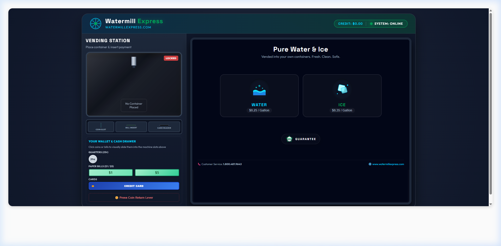
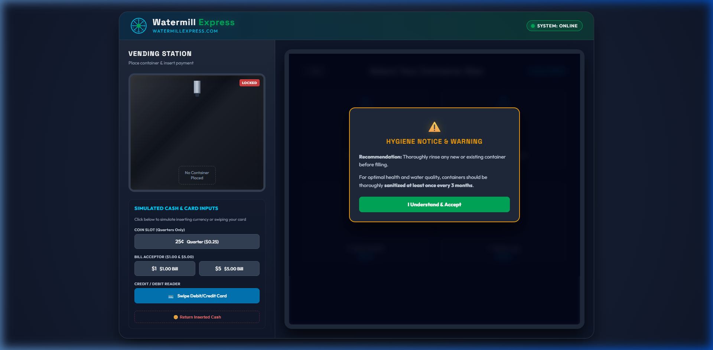
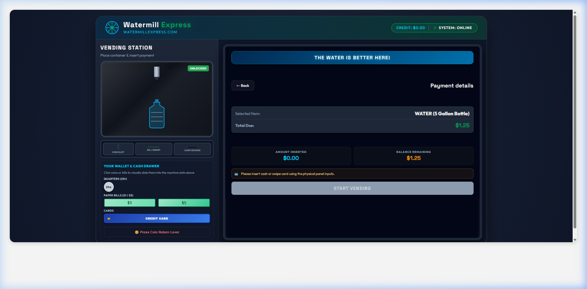
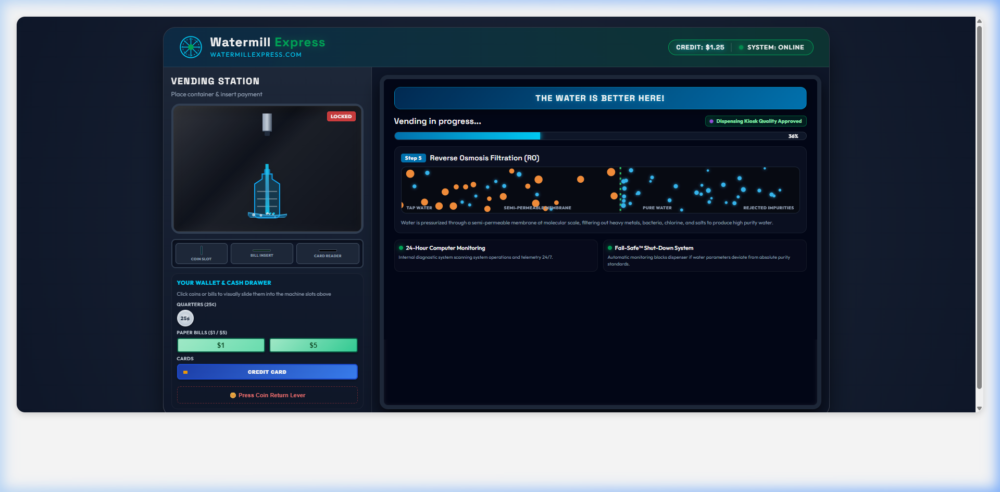
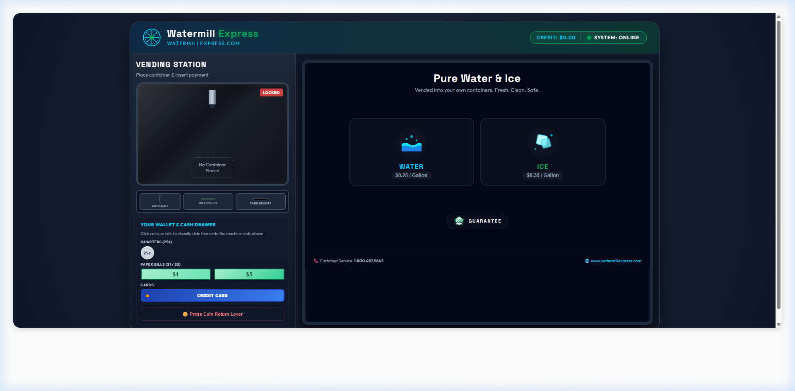
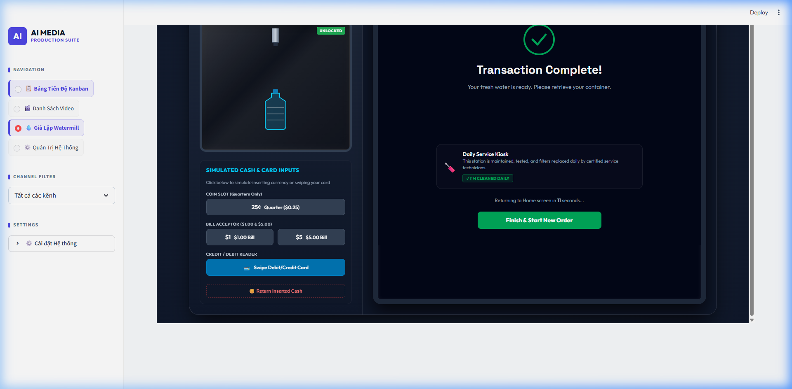

# Watermill Express Kiosk Simulator - User Manual

This manual provides instructions and detailed system guides for using the **Watermill Express Kiosk Simulator**, a high-fidelity web application simulating the physical vending cabinet and digital touchscreen interface of a standard Watermill Express water and ice vending kiosk.

---

## 1. System Overview

The kiosk simulator features a twin-column dashboard designed to mirror the user experience of a drive-up vending station:

1. **Left Panel (Physical Cabinet)**: Models the physical hardware, including the dispensing bay chamber, slot inputs (coins, bills, card reader), status LEDs, change return lever, and the user's cash drawer wallet.
2. **Right Panel (Touchscreen Terminal)**: Simulates the 12-inch interactive digital display screen which guides the user through product selection, hygiene guidelines, payment validation, and filtration diagnostic steps.

---

## 2. Interactive Components

```
+-------------------------------------------------------------------------+
|                          WATERMILL EXPRESS SIMULATOR                    |
+-------------------------------------+-----------------------------------+
|       PHYSICAL CABINET (LEFT)       |     TOUCHSCREEN TERMINAL (RIGHT)  |
|                                     |                                   |
| +---------------------------------+ | +-------------------------------+ |
| |        DISPENSING BAY           | | |         CREDIT: $0.00         | |
| |                                 | | +-------------------------------+ |
| |   (UV Glow, Spray, Container)   | | |                               | |
| +---------------------------------+ | |                               | |
|                                     | |          SCREEN VIEWS         | |
| +---------------------------------+ | |                               | |
| |          HARDWARE SLOTS         | | |  (Home -> Container Catalog   | |
| |   (Coin, Bill, Card Openings)   | | |    -> Payment -> Vending      | |
| +---------------------------------+ | |    -> Transaction Complete)   | |
|                                     | |                               | |
| +---------------------------------+ | |                               | |
| |         WALLET DRAWER           | | |                               | |
| |     (Quarters, Bills, Card)     | | |                               | |
| +---------------------------------+ | +-------------------------------+ |
|                                     | |   📞 1-800-487-9643            | |
| | [Lever] Press Coin Return       | | +-------------------------------+ |
+-------------------------------------+-----------------------------------+
```

### A. The User Wallet & Cash Drawer
Located at the bottom left, the wallet provides simulated funds to feed the machine:
- **Quarters (25¢)**: Click to eject a coin and watch it visually slide upwards into the **Coin Slot**.
- **Paper Bills ($1 / $5)**: Click to feed bills into the flashing horizontal **Bill Insert**.
- **Credit Card**: Ejects a chip card to swipe inside the **Card Reader**.

### B. Persistent Credit Display
The kiosk keeps track of credit balances in real time:
- Credit accumulates immediately when inserting cash on **any screen** (Home Screen, Container Selection, or Payment Details).
- The total inserted credit is persistently visible in the touchscreen's top status header bar as `CREDIT: $X.XX`.
- Balance automatically carries over across screens, enabling you to pre-fund your purchase before selecting a container.

### C. Coin Return Lever
If you have inserted credit and wish to cancel your purchase or receive change:
- Press the **Press Coin Return Lever** button at the bottom of the left cabinet.
- Synthesized coin clinking sounds will play, the credit balance will clear, and the status bar will reset back to `CREDIT: $0.00`.

---

## 3. Step-by-Step Vending Workflow

### Step 1: Product Selection
When the simulator initializes, the terminal displays the home screen welcoming the customer. Select the desired vending product:
- Click **WATER** ($0.25 / Gallon)
- Click **ICE** ($0.35 / Gallon)



### Step 2: Container Selection & Hygiene Notice
Once a product is chosen, the Container menu displays container options adapted for the selected product:
- **Water options**: 1 Gallon Jug, 3 Gallon Bottle, 5 Gallon Bottle, 5 Gallon Bottle with Spigot.
- **Ice options**: Small Cooler, Bucket, Personal Cooler, 20 lbs Ice Bag.
- A **Hygiene Notice Warning** will overlay recommending customers sanitize and rinse their container. Accept the notice to proceed.



### Step 3: Payment Verification
The touchscreen updates with receipt info, including product type, total cost, credit inserted, and balance remaining.
- Feed coins or bills from the wallet until the balance remaining reads `$0.00` and the display turns green.
- *Alternatively, swipe the Credit Card to pay the exact cost immediately.*
- The glowing green **START VENDING** button is enabled once paid in full.



### Step 4: Dispensing Progress
Vending progresses through three automated phases:
1. **Phase 1: UV Disinfection (0% - 30%)**: Neon purple sanitizing lights glow, and a high-frequency mist spray hiss plays.
2. **Phase 2: Solidification & Pouring (30% - 100%)**:
   - **Water Flow**: Fluid pours from the nozzle nozzle, and blue water rises with moving wave ripples inside the container outline. The Reverse Osmosis (RO) canvas panel animates molecules crossing the filtration membrane.
   - **Ice Flow**: The screen displays a sub-zero freezer cell matrix freezing solid in real time. Floating ice cubes tumble down and stack inside the bucket or cooler.
3. **Phase 3: Diagnostic LEDs**: Green computer monitoring lights flash, scanning system diagnostics.

| Water Vending | Ice Vending |
|---|---|
|  |  |

### Step 5: Transaction Completion
Once progress reaches 100%, progress alerts disappear, transaction completion chimes play, and the container shows filled.
- The screen updates to the **Transaction Complete** screen showing daily maintenance logs.
- The remaining credit balance is deducted from your inserted funds and displays in the header.
- Click **Finish & Start New Order** (or wait for the auto-timeout) to return to the Home page. Press the **Coin Return Lever** at the bottom left to retrieve any remaining change.



---

## 4. Technical Diagnostics

- **Synthesized Audio**: The audio is created programmatically using the browser's **Web Audio API** to compile quarter drops, sanitizing hiss, pump hums, and chimes. If no sounds play, ensure your browser has authorized audio permissions for the host (Streamlit prevents audio autoplay until a user clicks on the iframe workspace once).
- **Responsiveness**: Layout templates utilize absolute viewport limits. If elements are cut off on low-resolution displays, zoom out slightly (`Ctrl + -`) to fit the dashboard.
- **Fail-Safe system**: The dashboard LEDs reflect the status of the vending loop. Any dev exceptions inside the animation callbacks are caught by telemetry, turning indicators red to signal an automatic halt.
